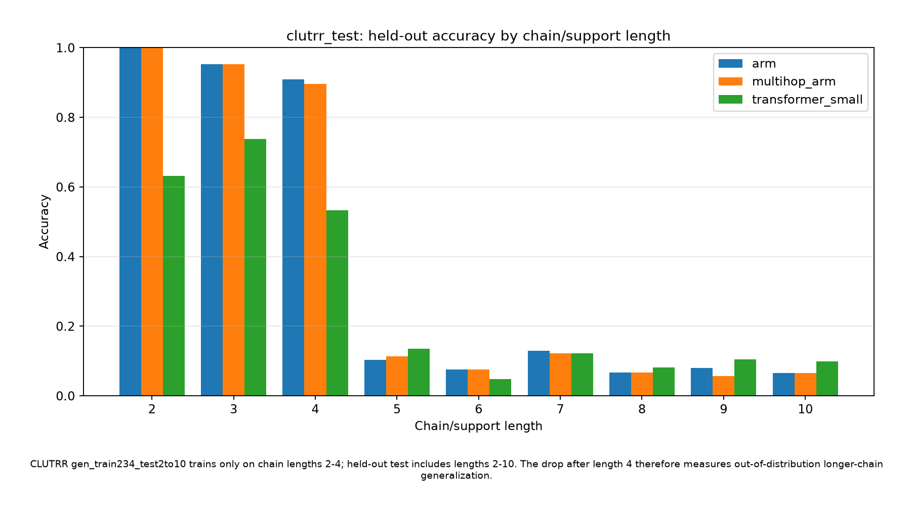

# Algebraic Resonance Memory (ARM)

Algebraic Resonance Memory is a PyTorch research prototype for **transformation-mediated memory retrieval**. Standard attention retrieves by direct query-key similarity. ARM retrieves by applying a learned family of algebraic operators to the query and aggregating the resonance of all transformed paths that reach each memory atom.

## Core equation

For query `q`, memory atom `m_i`, and learned operators `A_k`, ARM computes:

```text
rho(q, m_i) = logsumexp_k( -||A_k q + b_k - m_i||^2_D / tau - c_k )
R(q)        = softmax_i(rho(q, m_i)) M
```

This allows different cue forms, relational paths, or temporal states to converge to the same latent memory.

## Primary benchmark: CLUTRR real-data comparison

The default benchmark now uses **CLUTRR**, a real kinship-reasoning dataset downloaded automatically through Hugging Face `datasets`.

It compares:

1. `attention`: direct query-memory attention baseline.
2. `arm`: Algebraic Resonance Memory with learned operator paths.

Run locally:

```bash
pip install -r requirements.txt
python benchmarks/clutrr_compare.py --epochs 8
```

Outputs:

```text
benchmark_results/clutrr_compare.json
benchmark_results/clutrr_learning_curves.png
```

To compare ARM against a native PyTorch Transformer encoder classifier:

```bash
python benchmarks/clutrr_transformer_compare.py --epochs 8
```

This writes:

```text
benchmark_results/clutrr_transformer_compare.json
benchmark_results/clutrr_transformer_learning_curves.png
```

To compare ARM against multiple Transformer sizes and print sample predictions:

```bash
python benchmarks/clutrr_multi_transformer_compare.py --epochs 6 --transformers tiny,small,deep
```

This writes:

```text
benchmark_results/clutrr_multi_transformer_compare.json
benchmark_results/clutrr_multi_transformer_learning_curves.png
```

To evaluate held-out longer-chain inductive generalization:

```bash
python benchmarks/inductive_reasoning_compare.py --epochs 6 --models arm,transformer_small
```

This reports CLUTRR held-out test accuracy grouped by chain length, and auto-downloads the official Facebook bAbI archive for additional inductive QA tasks.

```text
benchmark_results/inductive_reasoning_compare.json
benchmark_results/clutrr_test_curves.png
benchmark_results/babi_curves.png
```

To compare the original single-hop ARM against experimental multi-hop ARM:

```bash
python benchmarks/multihop_arm_compare.py --benchmarks clutrr --epochs 6 --models arm,multihop_arm,transformer_small
```

Multi-hop ARM lives separately in `arm/multihop.py` and applies learned operators repeatedly before scoring memory.

```text
benchmark_results/multihop_arm_compare.json
```

To run the full standard multi-hop evaluation suite:

```bash
python benchmarks/run_multihop_full_eval.py
```

This runs CLUTRR for 6 epochs and bAbI tasks 2/3 for 25 epochs with `arm`, `multihop_arm`, and `transformer_small`, saving JSON summaries plus PNG curves, label mappings, chain/support bars, and sample prediction tables.

```text
benchmark_results/multihop_full_eval/clutrr_6/
benchmark_results/multihop_full_eval/babi_25/
benchmark_results/multihop_full_eval/full_eval_summary.json
```

### CLUTRR chain-length finding



For `gen_train234_test2to10`, CLUTRR trains only on chain lengths 2, 3, and 4, while the held-out test split contains chain lengths 2 through 10. Strong accuracy on lengths 2-4 followed by a drop on lengths 5-10 indicates the model learned the training chain distribution but still struggles with out-of-distribution longer-chain generalization.

The script automatically:

- downloads CLUTRR,
- detects available CLUTRR configs,
- falls back across configs if needed,
- infers story/query/label columns defensively,
- builds a word-level tokenizer,
- trains both ARM and attention under the same encoder setup,
- writes JSON metrics and a learning-curve plot.

## Run in Google Colab

Open:

```text
run_clutrr_auto_download.ipynb
```

or:

```text
arm_colab_runnable.ipynb
```

Both notebooks clone the repo, install dependencies, auto-download CLUTRR, and run the real-data benchmark.

## Repository structure

```text
arm/
  __init__.py              Public package exports
  models.py                ARM layer, attention baseline, encoders
  synthetic.py             Legacy synthetic cyclic fan-state dataset

benchmarks/
  clutrr_compare.py        Primary real-data ARM vs attention benchmark
  clutrr_transformer_compare.py  Real-data ARM vs Transformer benchmark
  clutrr_multi_transformer_compare.py  ARM vs multiple Transformer variants
  inductive_reasoning_compare.py  Held-out CLUTRR and synthetic inductive benchmarks
  multihop_arm_compare.py  Experimental single-hop ARM vs multi-hop ARM benchmark
  run_multihop_full_eval.py  Standard CLUTRR-6 + bAbI-25 multi-hop evaluation
  synthetic_compare.py     Legacy synthetic cyclic hidden-state benchmark

run_clutrr_auto_download.ipynb  Main CLUTRR auto-download Colab notebook
arm_colab_runnable.ipynb        CLUTRR-only Colab launcher
run_colab_benchmarks.ipynb      Optional benchmark launcher
requirements.txt                Python dependencies
```

## Optional legacy synthetic benchmark

The synthetic cyclic benchmark is still available for controlled debugging, but it is no longer the default benchmark path.

```bash
python benchmarks/synthetic_compare.py --epochs 20
```

## Notes on interpretation

The CLUTRR benchmark tests ARM against a direct attention-memory baseline under the same text encoder. Results should be interpreted as an initial architecture comparison, not as proof of general superiority over Transformer attention. Stronger claims require repeated runs, tuned baselines, confidence intervals, and larger-scale experiments.

## License

MIT License.
